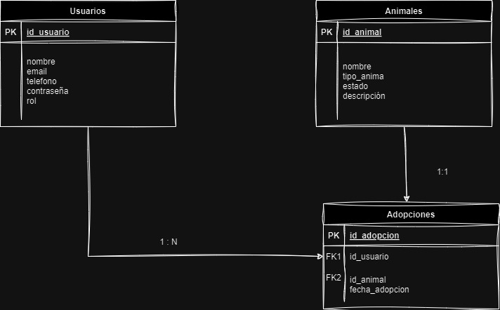

# Refugio Kimba

### Desarrollo web en Entorno Servidor
### UT02-b Spring Boot | Proyecto – API REST Segura
### __Sara Sánchez Camilleri.__

<hr>
<br>
<br>

a. Nombre del proyecto.
Refugio Kimba

Aplicación web y móvil para la gestión de una protectora de animales.

# b. Idea del Proyecto.

## API REST para una protectora de animales

Con vistas al Trabajo de Fin de Curso (TFC), este proyecto será una práctica que puede evolucionar para convertirse en una herramienta funcional o incluso en una parte del proyecto final.

La idea es desarrollar una aplicación web para una protectora de animales, cuyo objetivo principal será facilitar la gestión de las instalaciones y los animales en busca de adopción, además de promover la participación de voluntarios.

# c. Justificación del proyecto.

La gestión de protectoras de animales es una labor que requiere organización, dedicación y recursos limitados. Sin embargo, en la mayoría de los casos, estos centros dependen de procesos manuales, hojas de cálculo o herramientas básicas para registrar información sobre los animales, adopciones, voluntarios y donaciones.

Esta situación genera varios problemas:

- Falta de eficiencia: La información desorganizada puede retrasar las adopciones y el seguimiento de los animales.
- Dificultades de comunicación: La falta de centralización dificulta la coordinación entre los voluntarios y el personal.
- Pérdida de oportunidades: Sin un sistema adecuado, es más difícil captar padrinos, donantes y adoptantes.

Con este proyecto, buscamos ofrecer una solución práctica y eficiente mediante una aplicación web y móvil que permita:

1. Centralizar toda la información del refugio en un sistema digital seguro.
2. Optimizar los procesos internos, como la gestión de adopciones y apadrinamientos.
3. Mejorar la experiencia de los adoptantes, voluntarios y padrinos al proporcionarles acceso a información actualizada y personalizada.
4. Fortalecer la misión del refugio al facilitar la promoción de los animales en busca de hogar y la captación de apoyo.

<hr>
<br>
<br>

# d. Descripción detallada de las entidades

## 1. Planteamiento de las entidades

### Entidades básicas

Para garantizar un mínimo viable funcional, el proyecto trabajará inicialmente con las siguientes entidades fundamentales:

- Usuarios: Representarán a las personas que interactúan con el sistema. Los usuarios estarán clasificados en distintos roles según sus responsabilidades y actividades: administrador, voluntario, padrino, usuario regular, entre otros.
  - Roles básicos: administrador y usuario genérico.
  - Conforme se amplíen las funcionalidades, se irán incrementando los roles necesarios.


- Animales: Contendrá la información detallada de todos los animales registrados por la protectora, incluyendo datos básicos, estado de salud y disponibilidad para adopción o apadrinamiento.


- Adopciones: Gestionará y registrará la información relacionada con las adopciones realizadas, permitiendo un seguimiento detallado de los animales que han salido del refugio hacia un hogar permanente.

### Ampliación en entidades:

Conforme avance el desarrollo del proyecto, se integrarán nuevas entidades para ampliar las funcionalidades y proporcionar herramientas adicionales tanto para los usuarios como para el personal del centro. Estas futuras incorporaciones están diseñadas para mejorar la experiencia de usuario y optimizar los procesos internos del refugio. Las entidades adicionales son las siguientes:

- Apadrinamiento: Registro de animales apadrinados, asociándolos con usuarios responsables y facilitando la comunicación personalizada con los padrinos.

- Cita Veterinaria: Registro detallado de citas veterinarias asignadas a cada animal mientras permanezcan bajo la tutela del refugio.

- Donaciones: Registro de las donaciones realizadas al refugio, ya sea por usuarios registrados o donantes anónimos.

- Visitas al Centro: Gestión de actividades organizadas por el refugio, como jornadas de adopción y eventos educativos.


## 2. Descripción detallada de las entidades

### Usuarios
Campos principales:

- ```id_usuario```: INT (PK, AUTO_INCREMENT).
- ```nombre```: VARCHAR(100) (NOT NULL).
- ```email```: VARCHAR(255) (NOT NULL, UNIQUE).
- ```telefono```: VARCHAR(9) NOT NULL CHECK (telefono ~ '^[0-9]{9}$').
- ```contraseña```: VARCHAR(255) (NOT NULL, almacenada como hash).
- ```rol```: ENUM (administrador, voluntario, padrino, adoptante, genérico) NOT NULL.

Roles disponibles:

- ```Administrador```: Puede crear, leer, modificar y eliminar registros en la base de datos.
- ```Genérico```: Puede leer registros genéricos, como información sobre animales.

### Animales
Campos principales:

- ```id_animal```: INT (PK, AUTO_INCREMENT).
- ```nombre```: VARCHAR(100) (NOT NULL).
- ```tipo_animal```: ENUM (perro, gato) (NOT NULL).
- ```estado```: ENUM (en adopción, apadrinado, en tratamiento, adoptado) (NOT NULL).

### Adopciones
Campos principales:

- ```id_adopcion```: INT (PK, AUTO_INCREMENT).
- ```id_usuario```: INT (FK, referencia a Usuarios.id_usuario).
- ```id_animal```: INT (FK, referencia a Animales.id_animal).
- ```fecha_adopcion```: DATE (NOT NULL).
- ```observaciones```: TEXT (NULLABLE).

Relaciones:

- **Usuario y Adopciones**: Relación 1:N (Un usuario puede adoptar múltiples animales).
- **Animal y Adopciones**: Relación 1:1 (Un animal solo puede ser adoptado una vez).

<hr>
<br>
<br>

# 4. Diagrama Entidad/Relación


